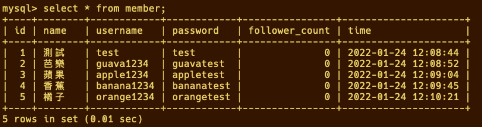
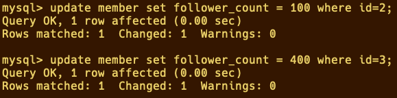
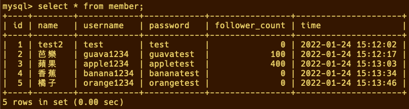
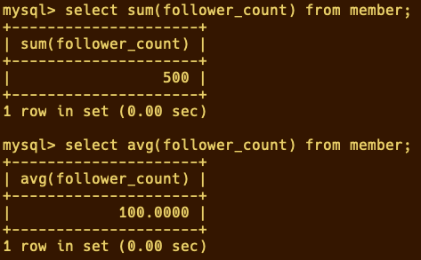

### SQL CRUD

#### 使用 INSERT 指令新增一筆資料到 member 資料表中，這筆資料的 username 和 password 欄位必須是 test。接著繼續新增至少 4 筆隨意的資料。

#### 使用 SELECT 指令取得所有在 member 資料表中的會員資料。

#### 使用 SELECT 指令取得所有在 member 資料表中的會員資料，並按照 time 欄位，由近到遠排序。

#### 使用 SELECT 指令取得 member 資料表中第 2 ~ 4 共三筆資料，並按照 time 欄位，由近到遠排序。

#### 使用 SELECT 指令取得欄位 username 是 test 的會員資料。

#### 使用 SELECT 指令取得欄位 username 是 test、且欄位 password 也是 test 的資料。

#### 使用 UPDATE 指令更新欄位 username 是 test 的會員資料，將資料中的 name 欄位改成 test2。

### SQL Aggregate Functions

#### 取得 member 資料表中，總共有幾筆資料 ( 幾位會員 )。

#### 取得 member 資料表中，所有會員 follower_count 欄位的總和。

#### 取得 member 資料表中，所有會員 follower_count 欄位的平均數。

#### EX:因為上面都是0很沒有運算的感覺，所以在部分member資料更新follower_count確認sum,avg的數值變化

### SQL JOIN(Optional)

#### 使用 SELECT 搭配 JOIN 語法，取得所有留言，結果須包含留言者會員的姓名。

#### 使用 SELECT 搭配 JOIN 語法，取得 member 資料表中欄位 username 是 test 的所有留言，資料中須包含留言者會員的姓名。
